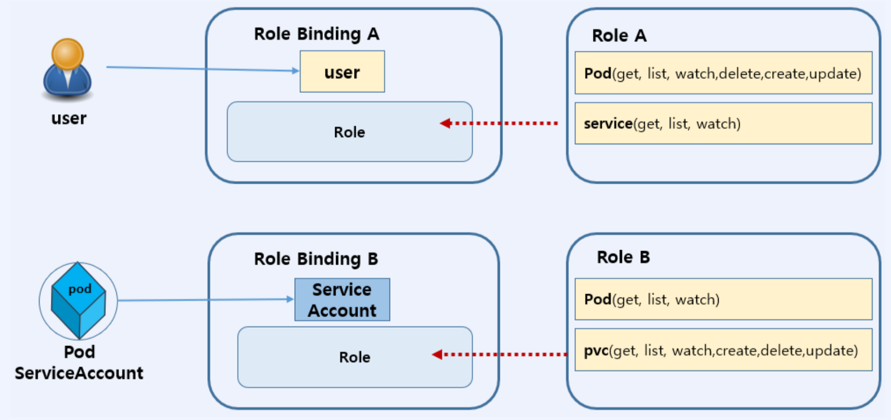

# CKA
## ETCD
  - key:value 형태의 데이터 스토리지
  - k8s cluster의 정보를 저장해서 사용
  - 모든 etcd 데이터는 etcd DB file에 보관 : /var/lib/etcd
  - etcd 관리 명령 : etcdctl
  - etcdctl 설치 확인
    ```
    ETCD를 호스팅 할 시스템에 ssh 로그인
    $ ssh k8s-master
    $ etcd --version
    $ etcdctl version
    ```

  - Backup & Restore
    - master의 장애와 같은 예기치 못한 사고로 인해 ETCD DB가 유실될 경우를 대비해서 Backup API를 제공
      - ETCD snapshot : control-plane(master) -> etcdctl snapshot save <snapshot filename>
      - ETCD restore : Snapshot으로 저장한 DB파일을 동작 중인 etcd에 적용하여 snapshot 생성 시점으로 되돌리기
        - 단계 1) snapshot 파일을 DB 파일로 복원
        - 단계 2) 동작 중인 etcd Pod의 구성정보를 복원된 DB위치로 수정 적용
        - $ etdctl snapshot restore <snapshot filename>
    
    - ETCD Backup
    [K8s backup](https://kubernetes.io/docs/tasks/administer-cluster/configure-upgrade-etcd/#backing-up-an-etcd-cluster)
    ```
    trusted-ca-file 확인
    $ ps -ef | grep kube | grep trusted-ca-file
    cert-file 확인
    $ ps -ef | grep kube | grep cert-file
    key-file 확인
    $ ps –ef | grep kube | grep key-file
    $ sudo ETCDCTL_API=3 etcdctl --endpoints=https://127.0.0.1:2379 \
    --cacert=/etc/kubernetes/pki/etcd/ca.crt \
    --cert=/etc/kubernetes/pki/etcd/server.crt \
    --key=/etc/kubernetes/pki/etcd/server.key \
    snapshot save /tmp/etcd-backup
    ```
    - 현재 etcd 상태를 수정 하고 snapshot 파일을 이용해 복원했을 때 원래대로 복원되었는지 확인
    ```
    $ kubectl get pods
    $ kubectl delete deployment XXXXX
    $ kubectl get pods
    ```
    - ETCD Restore
    [K8s restore](https://kubernetes.io/docs/tasks/administer-cluster/configure-upgrade-etcd/#restoring-an-etcd-cluster)
    ```
    $ sudo ETCDCTL_API=3 etcdctl --data-dir=/var/lib/etcd-new snapshot restore
    /tmp/etcd-backup
    $ sudo tree /var/lib/etcd-new/
    ```

    - etcd Pod에 복원된 etcd-data 위치를 적용하고 Pod 다시 시작
    
      ```
      $ sudo vi /etc/kubernetes/manifests/etcd.yaml
      ---
      - hostPath:
      path: /var/lib/etcd-new
      type: DirectoryOrCreate
      name: etcd-data
  
      #docker 명령으로 etcd가 restart 되었는지 확인
      $ sudo docker ps -a | grep etcd
      # 복원되었는지 확인
      $ kubectl get pods
      ```

## Kubernetes Cluster
- Kubernetes Packages
  - kubeadm : cluster를 부트스트랩하는 명령
  - kubelet : Pod와 Container 시작과 같은 작업을 수행하는 component
  - kubectl : cluster와 통신하기 위한 command line utility
    [kubernetes packages](https://kubernetes.io/images/docs/kubernetes-cluster-architecture.svg)
  - Kubernetes cluster upgrade
    - kubeadm, kubelet, kubectl을 1.22.4에서 1.23.3 버전으로 업그레이드
    1. Control-plane Upgrade
       a. Upgrade master connection
       ```
        $ ssh <master>
       ```
       b. version check
       ```
        $ sudo yum list --showduplicates kubeadm --disableexcludes=kubernetes | tail -5
       ```
       c. kubeadm upgrade
       ```
        $ sudo yum install -y kubeadm-1.23.3-0 --disableexcludes=kubernetes
        $ kubeadm version
        $ sudo kubeadm upgrade plan v1.23.3
        $ sudo kubeadm upgrade apply v1.23.3
       ```
       d. node drain : console이나 master에서 실행
       ```
        $ kubectl drain {node} --ignore-daemonsets
       ```
       e. kubelet & kubectl upgrade
       ```
        $ sudo yum install -y kubelet-1.23.3-0 kubectl-1.23.3-0 --disableexcludes=kubernetes
        $ sudo systemctl daemon-reload
        $ sudo systemctl restart kubelet
       ```
       f. node uncordon
       ```
        $ kubectl uncordon {node}
       ```
     2. Worker node Upgrade
        a. upgrade node connection
        b. kubeadm upgrade
        ```
         $ sudo yum install -y kubeadm-1.23.3-0 --disableexcludes=kubernetes
        ```
        c. "kubeadm upgrade" call
        ```
         $ sudo kubeadm upgrade node
        ```
        d. node drain
        ```
         $ kubectl drain <node> --ignore-daemonsets
        ```
        e. kubelet, kubeadm upgrade
        ```
         $ sudo yum install -y kubelet-1.23.3-0 kubectl-1.23.3-0 --disableexcludes=kubernetes
        ```
        f. node uncordon
        ```
         $ kubectl uncordon <node>
        ```

## API인증 : RBAC
- API서버에 접근하기 위해서는 **인증**작업 필요
- Role-based access control(RBAC, 역할기반 액세스 제어)이며, 사용자의 역할에 따라 리소스에 대한 접근 권한을 가짐
- User : Cluster 외부에서 kubernetes를 조작하는 사용자 인증
  ```
  ..
  contexts:
  - context:
      cluster: kubernetes
      user: kubernetes-admin
    name: kubernetes-admin@kubernetes
  ..
  users:
  - name: kubernetes-admin
    user:
      client-certificate-data: LS0tLS1CRU--인증서
  ```
- Service Account: Pod가 kubernetes API를 다룰 때 사용하는 계정
  ```
   $ kubectl get pods {pod name} -o yaml | grep -i serviceaccount
   $ kubectl get secrets default-token-gvdn7
  ```
- **Role & RoleBinding를 이용한 권한 제어**
  - 특정 유저나 ServiceAccount가 접근하려는 API에 접근 권한을 설정
  - 권한 있는 User만 접근하도록 허용
  - 권한 제어
    - Role
      - 어떤 API를 이용할 수 있는지를 정의
      - k8s의 사용권한을 정의
      - 지정된 namespace에서만 유효
      - Role example : default namespaces의 pod에 대한 get,watch,list 할수 있는 권한
        ```
          apiVersion: rbac.authorization.k8s.io/v1
          kind: Role
          metadata:
            namespace: default
            name: pod-reader
          rules:
          - apiGroups:[""]
            **verbs: ["get","watch","list"]**
        ```
    - RoleBinding
      - 사용자/그룹 또는 Service Account와 role을 연결
      - RoleBinding example : default namespace에서 user jane에게 pod-reader의 role 할당
        ```
        ```
      - 